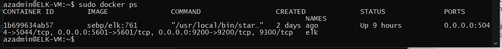

# Automated ELK Stack Deployment

The files in this repository were used to configure the network depicted below.

**Network Diagram**

These files have been tested and used to generate a live ELK deployment on Azure. They can be used to either recreate the entire deployment pictured above. Alternatively, select portions of the **playbook (.yml)** file may be used to install only certain pieces of it, such as Filebeat.

  - [ELK Playbook](/Ansible/install-elk.yml)
    
This document contains the following details:
- Description of the Topology
- Access Policies
- ELK Configuration
  - Beats in Use
  - Machines Being Monitored
- How to Use the Ansible Build

### Description of the Topology

The main purpose of this network is to expose a load-balanced and monitored instance of DVWA, the D*mn Vulnerable Web Application.

Load balancing ensures that the application will be highly protected, in addition to restricting inbound traffic to the network.

- **What aspect of security do load balancers protect?** 
	Load Balancing automatically distributes the incoming traffic across the network. Load balancer operates at layer four of the OSI Model. Azure provides a suite of fully managed load-balancing solutions. Load balancer supports both inbound and outbound network traffic. Azure load balancer uses health prove to monitor load-balanced resources. It also prevents downtime as it gives redundancies to the system.

- **What is the advantage of a jump box?** 
	A jump-box a SSH gateway to a remote network, through which a connection can be made to another host in a different security zone. Jump-box host should be secured and regularly being monitored. Jump box prevents all Azure VM’s to expose to the public. It also helps to open only one port instead of several ports to connect different virtual machines present in the Azure cloud.

Integrating an ELK server allows users to easily monitor the vulnerable VMs for changes to the logs and system metric.

- **What does filebeat watch for?**
	Filebeat is an open-source system. It monitors the log files or locations that you specify, collects log events, and forwards them either to Elasticsearch or Logstash for indexing. It helps keep things simple by forwarding and centralizing logs and files, making the use of SSH unnecessary when you have several servers, virtual machines, and containers that generate logs.

- **What does Metricbeat record?**
	Metricbeat collects metrics from the operating system, application and services running on the server. It helps to monitor the servers by collecting metrics from the system and services running on the server. 

The configuration details of each machine may be found below.

| Name     | Function   | IP Address | Operating System |
|----------|------------|------------|------------------|
| Jump-Box | Gateway    | 10.0.0.4   | Linux            |
| Web-1    | WebServer  | 10.0.0.5   | Linux            |
| Web-2    | WebServer  | 10.0.0.6   | Linux            |
| Web-3    | WebServer  | 10.0.0.7   | Linux            |
| ELK      | Monitoring | 10.1.0.4   | Linux            |

### Access Policies

The machines on the internal network are not exposed to the public Internet. 

Only the **Jump-box** machine can accept connections from the Internet. Access to this machine is only allowed from the following IP addresses:

Add whitelisted IP addresses

- WebServers Public IP: 104.42.153.206:80
- ELK Server Public IP: 168.62.53.233:5601

Machines within the network can only be accessed by 'SSH'.
- Which machine did you allow to access your ELK VM?
	- Jump-Box
- What was its IP address?
	- IP: 10.0.0.4 / 13.64.187.206

A summary of the access policies in place can be found in the table below.

| Name     | Publicly Accessible | Allowed IP Addresses      |
|----------|---------------------|---------------------------|
| Jump Box | No                  | 13.64.187.206             |
| Web-1    | Yes                 | 104.42.153.206            |
| Web-2    | Yes                 | 104.42.153.206            |
| Web-3    | Yes                 | 104.42.153.206            |
| ELK      | Yes                 | 168.62.53.233:5601        |

### Elk Configuration

Ansible was used to automate configuration of the ELK machine. No configuration was performed manually, which is advantageous because using ansible makes the installation, update and adding servers much quicker. 

What is the main advantage of automating configuration with Ansible?
	
- The main aim of ansible is to provide large productivity gains to a wide variety of automation challenges. This tool is extremely easy and simple to use and yet powerful enough to automate complex multi-tier IT application environments. Here are some of the advantages of using Ansible:
	- Ansible is an open-source tool
	- Shell scripts are simple and no need of any other software installed
	- It only needs to run script one time and everything will be setup
	- Ansible does not requires agents 
	- Ansible has powerful features that can manage the network, operating systems and services. 
	- No extra software on the server. 
	- Ansible can be customized as what IT needs

The playbook implements the following tasks:
- In 3-5 bullets, explain the steps of the ELK installation play. E.g., install Docker; download image; etc.
	- Install docker.io
	- Install python3-pip
	- Install docker python module
	- Increase virtual memory
	- Download and launch a docker container

### The following screenshot displays the result of running `docker ps` after successfully configuring the ELK instance.

### Target Machines & Beats

This ELK server is configured to monitor the following machines:
- List the IP addresses of the machines you are monitoring
	| Name     | IP Address |
	|----------|------------|
	| Web-1    | 10.0.0.5   |
	| Web-2    | 10.0.0.6   |
	| Web-3    | 10.0.0.7   |

We have installed the following Beats on these machines:
- Beats that were successfully installed:
	- filebeat
	- metricbeat

These Beats allow us to collect the following information from each machine:
	
- Filebeat - monitors log files and collects log events. is a lightweight shipper for forwarding and centralizing log data

- Metricbeat - is installed to different servers to monitor and analyze system CPU, memory and external services running on the system. It also monitors container performance metrics. 

### Using the Playbook

In order to use the playbook, you will need to have an Ansible control node already configured. Assuming you have such a control node provisioned: 

SSH into the control node and follow the steps below:
- Copy the playbook (.yml) file to ansible folder (/etc/ansible/files).
- Update the hosts file to include: webservsers and elk host
- Run the playbook, and navigate to 'Kibana' to check that the installation worked as expected.

**Answer the following questions to fill in the blanks:**
- Which file is the playbook? 
	- **filebeat.yml / metricbeat.yml**
	
- Where do you copy it?
	- **/etc/ansible/files**
	
- Which file do you update to make Ansible run the playbook on a specific machine? 
	- **hosts**
	
- How do I specify which machine to install the ELK server on versus which to install Filebeat on?
	- **hosts: webservers**
	
- Which URL do you navigate to in order to check that the ELK server is running?
	**http://168.62.53.233:5601/app/kibana#/home**

- As a **Bonus**, provide the specific commands the user will need to run to download the playbook, update the files, etc.

- Update the following files /etc/ansible: 
	- hosts: adding the websers and elk
	- ansible.cfg: remote_user = azadmin
- Need to increase memory count
	- value: 262144
- download/run
	- sebp/elk:761
- run playbook
	- ansible-playbook elk.yml
	