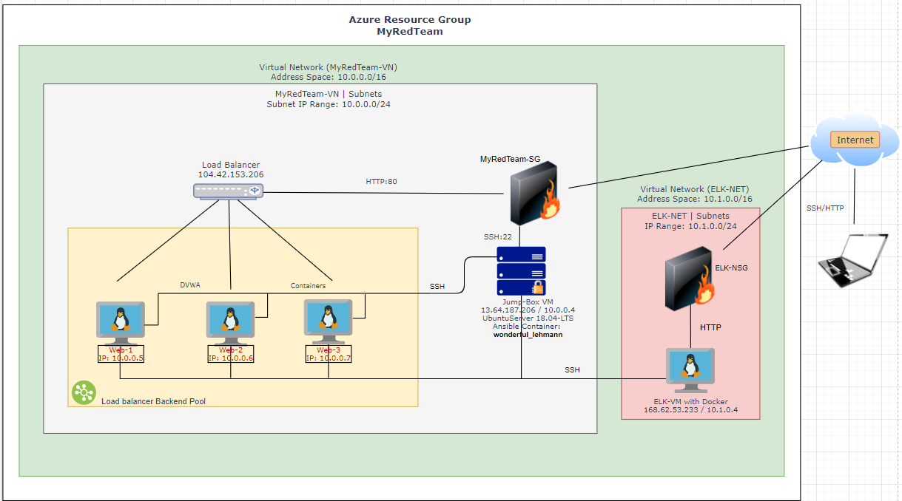

# Automated ELK Stack Deployment

The files in this repository were used to configure the network depicted below.
- Network Diagram

- AZURE Topology

These files have been tested and used to generate a live ELK deployment on Azure. They can be used to either recreate the entire deployment pictured above. Alternatively, select portions of the **playbook (.yml)** file may be used to install only certain pieces of it, such as Filebeat.

  - 
